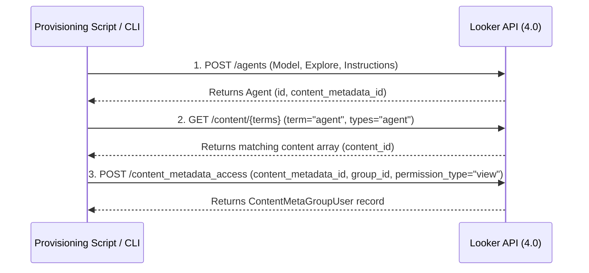

# Create Conversational Analytics Agent & Grant Embed Group Access

This skill details how to programmatically instantiate a **Looker Conversational Analytics (CA) Agent** with custom prompt instructions connected to a target LookML model and explore, search for its content metadata entry, and grant `"view"` access permissions to an embedded user group using Looker API raw request endpoints.

---

# Execution Sequence Overview

Provisioning an embedded Conversational Analytics agent involves a three-step raw API request sequence:



1. **`POST /agents`**: Creates the CA agent with the specified source (`model`, `explore`), agent `name`, `description`, and custom `instructions` (system prompt).
2. **`GET /content/{terms}`**: Searches content items matching term `agent` or agent title to locate the agent's `content_id` and confirm content index registration.
3. **`POST /content_metadata_access`**: Creates a content metadata access rule granting `"view"` permission for the target embed user group (`group_id`).

---

# Looker Swagger API Documentation Reference

Based on Looker's OpenAPI/Swagger spec (`swagger.json`), the request and response structures for these endpoints are defined as follows:

## 1. Create Agent: `POST /agents`
- **Endpoint**: `/api/4.0/agents`
- **Method**: `POST`
- **Summary**: Creates a new Conversational Analytics Agent.
- **Request Parameters**:
  - `body` (JSON, required): `Agent` object with `name`, `description`, `sources`, and `context`.

### Request Body Schema
```json
{
  "name": "Shipping Logistics Agent",
  "description": "Conversational Analytics Agent for Shipping Logistics",
  "sources": [
    {
      "model": "embed_demo",
      "explore": "shipping_logistics"
    }
  ],
  "context": {
    "instructions": "You are an expert shipping logistics data analyst. Answer questions about shipment status, delays, carrier performance, and delivery metrics accurately and concisely."
  }
}
```

> [!NOTE]
> The `category` field is optional. If passed, it must match supported Looker agent categories or be omitted (`null`).

### Response Schema (`200 OK`)
```json
{
  "id": "aca3558ad75142dd8305cb5c4d0b6235",
  "name": "Shipping Logistics Agent",
  "description": "Conversational Analytics Agent for Shipping Logistics",
  "category": null,
  "content_metadata_id": "29283",
  "created_by_user_id": "2",
  "created_at": "2026-08-06T16:50:15.000+00:00",
  "sources": [
    {
      "model": "embed_demo",
      "explore": "shipping_logistics"
    }
  ],
  "context": {
    "instructions": "You are an expert shipping logistics data analyst."
  }
}
```

---

## 2. Search Content: `GET /content/{terms}`
- **Endpoint**: `/api/4.0/content/{terms}`
- **Method**: `GET`
- **Path Parameter**: `terms` (string, required) - Search query term (e.g. `agent` or the agent's name).
- **Query Parameter**: `types` (string, optional) - Content type filter (e.g. `types=agent`).

### Response Schema (`200 OK`)
Returns an array of `ContentSearch` objects:
```json
[
  {
    "content_id": "aca3558ad75142dd8305cb5c4d0b6235",
    "type": "agent",
    "title": "Shipping Logistics Agent",
    "description": "Conversational Analytics Agent for Shipping Logistics",
    "folder_id": "-1",
    "folder_name": "\"unknown\"",
    "view_count": 0,
    "model": ""
  }
]
```

---

## 3. Create Content Metadata Access: `POST /content_metadata_access`
- **Endpoint**: `/api/4.0/content_metadata_access`
- **Method**: `POST`
- **Summary**: Creates content metadata access permissions for a user or group.
- **Request Parameters**:
  - `body` (JSON, required): `ContentMetaGroupUser` object specifying `content_metadata_id`, `group_id`, and `permission_type`.

### Request Body Schema
```json
{
  "content_metadata_id": "29283",
  "group_id": "9",
  "permission_type": "view"
}
```

### Response Schema (`200 OK`)
```json
{
  "id": "57799",
  "content_metadata_id": "29283",
  "permission_type": "view",
  "group_id": "9",
  "user_id": null
}
```

---

# Command Line & API Executions

## Option A: Using `looker-cli` / Raw API Requests

You can execute raw API calls directly using `looker-cli api`:

```bash
# 1. Create Agent via POST /agents
cat << 'EOF' > agent_body.json
{
  "name": "Shipping Logistics Agent",
  "description": "Conversational Analytics Agent for Shipping Logistics",
  "sources": [
    {
      "model": "embed_demo",
      "explore": "shipping_logistics"
    }
  ],
  "context": {
    "instructions": "You are an expert shipping logistics data analyst."
  }
}
EOF

cat agent_body.json | looker-cli api agents create_agent - --token-file

# 2. Search Content via GET /content/{terms}
looker-cli api content search_content agent --token-file

# 3. Grant Group Access via POST /content_metadata_access
cat << 'EOF' > access_body.json
{
  "content_metadata_id": "<CONTENT_METADATA_ID>",
  "group_id": "<GROUP_ID>",
  "permission_type": "view"
}
EOF

cat access_body.json | looker-cli api content_metadata_access create_content_metadata_access - --token-file
```

---

## Option B: Python SDK / Code Mode Execution

When working inside the development environment or executing via the `lkr_dev_cli_codemode` MCP server (`run_python_code`), use Looker Python SDK raw endpoint methods (`sdk.post` and `sdk.get`):

```python
import os, json, dotenv, looker_sdk

dotenv.load_dotenv('.env')
sdk = looker_sdk.init40()

# 1. Create Agent
agent_payload = {
    "name": "Shipping Logistics Agent",
    "description": "Conversational Analytics Agent for Shipping Logistics",
    "sources": [{"model": "embed_demo", "explore": "shipping_logistics"}],
    "context": {
        "instructions": "You are an expert shipping logistics analyst."
    }
}
agent = sdk.post("agents", structure=dict, body=agent_payload)
agent_id = agent.get("id")
cm_id = agent.get("content_metadata_id")

# 2. Search Content
content_items = sdk.get("content/agent", structure=list)
agent_content = next((c for c in content_items if c.get("type") == "agent" and c.get("content_id") == agent_id), None)

# 3. Grant Group Access
groups = sdk.search_groups(name="Embed Demo Users")
group_id = str(groups[0].id if groups else "9")

access_payload = {
    "content_metadata_id": str(cm_id),
    "group_id": group_id,
    "permission_type": "view"
}
access_rec = sdk.post("content_metadata_access", structure=dict, body=access_payload)
```

---

# Modular Helper Script

A complete, self-contained Python script is provided in [`./scripts/create_ca_agent.py`](./scripts/create_ca_agent.py).

To execute via `uv run`:
```bash
uv run --project backend python .agents/skills/create-conversational-analytics-agent/scripts/create_ca_agent.py
```

---

# Verification & Verification Checklist

- [ ] Confirm agent creation by calling `GET /agents/{agent_id}` or `GET /agents/search`.
- [ ] Confirm content index registration via `GET /content/agent`.
- [ ] Confirm access control rules via `GET /content_metadata_access?content_metadata_id={content_metadata_id}`.
- [ ] Test chat functionality with embed users assigned to the target user group.
